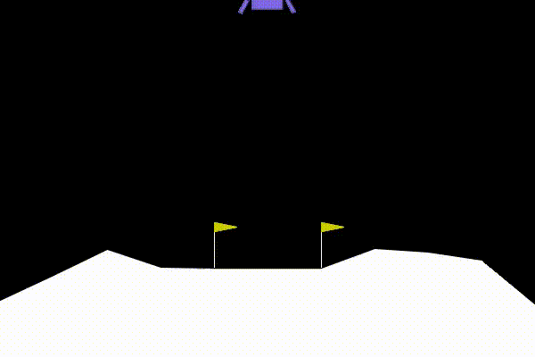
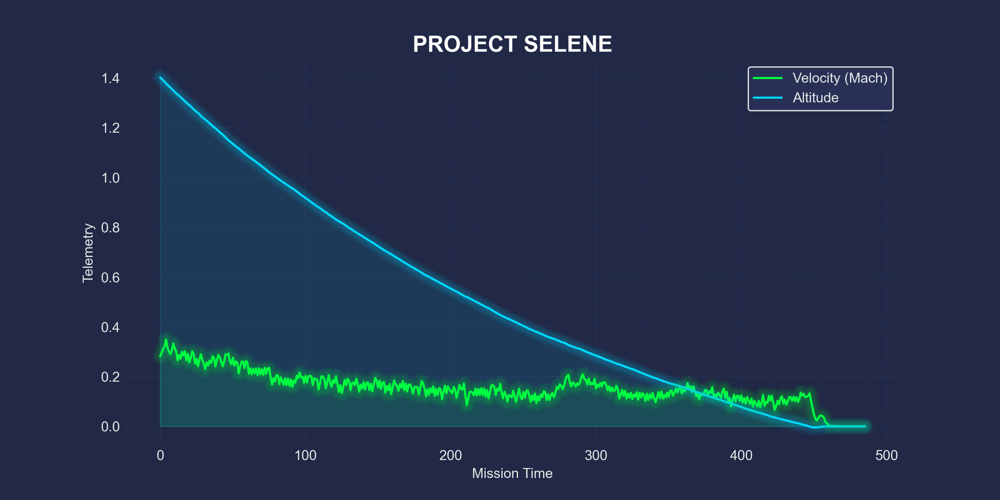

#  Project Selene: Autonomous Lunar Lander


> **An AI pilot that taught itself to land on the Moon through 500,000 steps of trial and error.**

---

##  Demonstration


*Above: The fully trained "Ace Pilot" agent executing a perfect suicide burn and soft touchdown.*

---

##  Overview

**Project Selene** is a Deep Reinforcement Learning project that solves the classic `LunarLander-v2` environment. Unlike traditional PID controllers that use hard-coded physics rules, this agent started with **zero knowledge** of gravity or thrust. 

Using **Proximal Policy Optimization (PPO)**, the agent learned to:
1.  Manage fuel efficiency.
2.  Stabilize flight trajectory against random initial forces.
3.  Execute a soft landing (Velocity $\approx$ 0) between the flags.

##  Performance Metrics

After **500,000 training steps**, the agent achieved "Ace" status, consistently outperforming the environment's solving threshold of 200 points.

| Metric | Result | Notes |
| :--- | :--- | :--- |
| **Success Rate** | **87.0%** | Over 100 test episodes |
| **Average Reward** | **+222** | "Solved" status is >200 |
| **Algorithm** | PPO | MlpPolicy, Ent_coef=0.01 |

### Telemetry Dashboard
To visualize the thinking process, I built a custom telemetry pipeline using `mplcyberpunk` to track altitude vs. velocity in real-time.


*A smooth, confident descent with a final velocity flare right before touchdown.*

---

##  Tech Stack

* **Core:** Python 3.10
* **Environment:** Gymnasium (`LunarLander-v2`)
* **RL Algorithm:** Stable-Baselines3 (PPO)
* **Visualization:** Matplotlib, Mplcyberpunk, MoviePy
* **Physics Engine:** Box2D

---

## 💻 How to Run This Locally

Want to see it fly on your own machine?

1.  **Clone the Repository**
    ```bash
    git clone [https://github.com/syd311/project-selene.git](https://github.com/syd311/project-selene.git)
    cd project-selene
    ```

2.  **Install Dependencies**
    ```bash
    pip install gymnasium[box2d] stable-baselines3 shimmy matplotlib mplcyberpunk moviepy
    ```

3.  **Run the Simulation**
    ```bash
    python record_show.py
    ```
    *This will load the pre-trained `neural_lander_FINAL.zip` and generate a new landing video.*


---

##  License
This project is licensed under the MIT License - see the [LICENSE](LICENSE) file for details.

---
*Created by [syd311](https://github.com/syd311)*